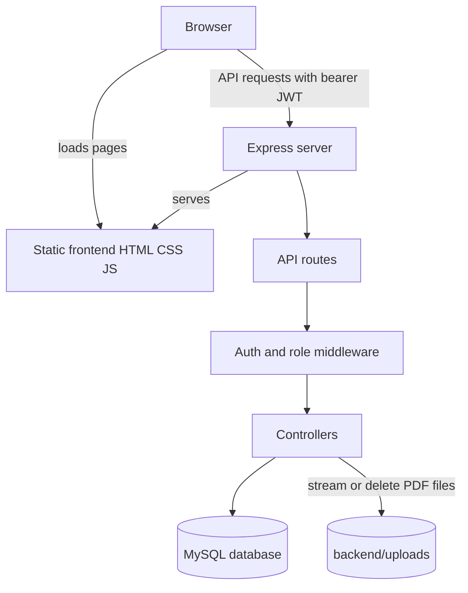
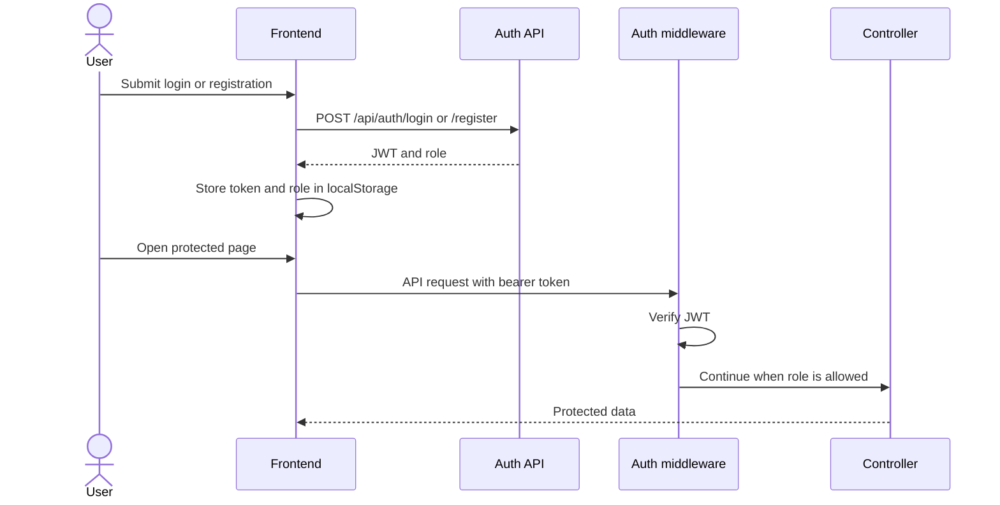
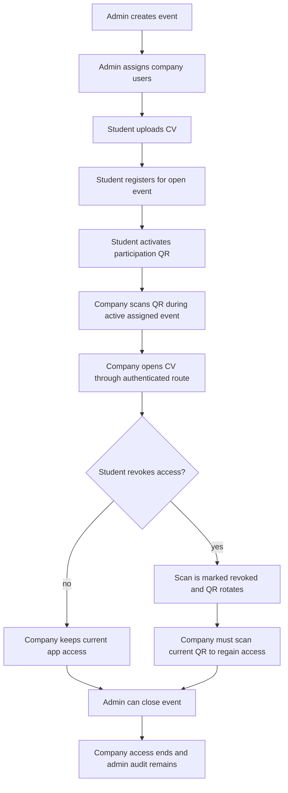
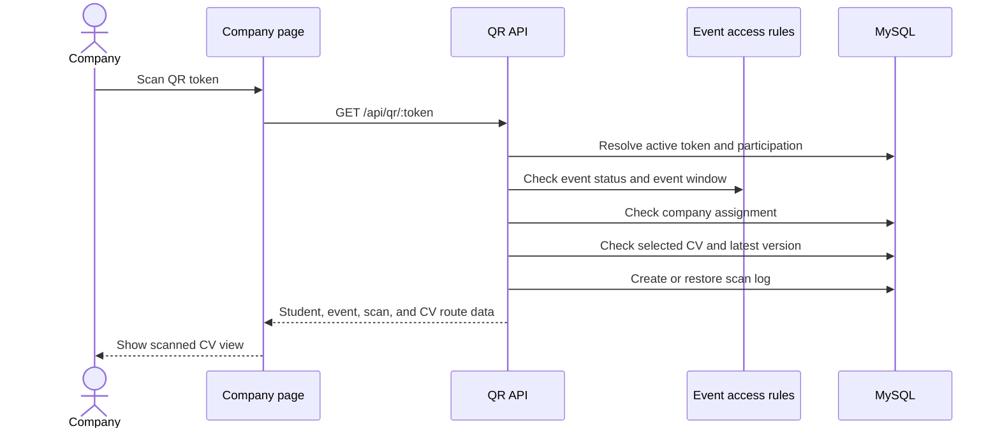

# Architecture

CVQR is built as one Express application that exposes API routes and serves the static frontend from the same server.



## Server Entry Point

`backend/server.js`:

- loads environment variables,
- creates the Express app,
- enables CORS and JSON parsing,
- mounts API route groups under `/api`,
- serves `frontend/` as static files,
- exposes `/` as the main landing page,
- exposes `/db-test` for local database checks,
- starts the server on port `3000` when run directly.

## Route Groups

| Route group | File | Responsibility |
| --- | --- | --- |
| `/api/auth` | `backend/routes/authRoutes.js` | Register and login. |
| `/api/cv` | `backend/routes/cvRoutes.js` | Student CV upload/versioning and secure CV file delivery. |
| `/api/events` | `backend/routes/eventRoutes.js` | Student-visible open events. |
| `/api/participations` | `backend/routes/participationRoutes.js` | Student event registration, QR generation, scan visibility, and revocation. |
| `/api/qr` | `backend/routes/qrRoutes.js` | Student QR retrieval and company QR scanning. |
| `/api/company` | `backend/routes/companyRoutes.js` | Company assignments, scan history, and favorites. |
| `/api/admin` | `backend/routes/adminRoutes.js` | Admin events, users, CVs, registrations, assignments, and audit views. |

## Role-Based Frontend Areas

| Area | Path | Main scripts |
| --- | --- | --- |
| Public | `/`, `/login/`, `/register/` | `login.js`, `register.js` |
| Student | `/student/`, `/student/cv/` | `student-home.js`, `student-cv.js` |
| Company | `/company/`, `/company/history/`, `/company/cv/` | `company-scan.js`, `company-history.js`, `company-view.js` |
| Admin | `/admin/`, `/admin/events/`, `/admin/users/`, `/admin/cvs/`, `/admin/registrations/` | `admin-*.js` |

Frontend pages use `CVQR.requireRole(...)` to redirect users whose stored role does not match the page. Backend middleware is still the real security boundary.

## Authentication Flow

1. A user registers or logs in through `/api/auth`.
2. The backend returns a JWT containing user identity and role data.
3. The frontend stores the token and role in `localStorage`.
4. API requests include `Authorization: Bearer <token>`.
5. Backend authentication middleware verifies the token.
6. Role middleware blocks routes that do not match the required role.



## Main Domain Flow



## QR Scan Flow

When a company scans a token:

1. The public `/qr/:token` page handles camera/browser opens.
2. The `/api/qr/:token` route requires a company JWT.
2. The token is resolved to an active participation.
3. The event must be open and active by date window.
4. The company must be assigned to that event.
5. The participation must have a selected CV with a retained version.
6. A scan log is created or updated.
7. The response points the frontend to authenticated CV file routes.

Old tokens can remain in the database for auditability, but revoked tokens are rejected.



## CV File Flow

Uploaded PDFs are stored under `backend/uploads`. They are not exposed as public static assets.

Files are streamed through authenticated API routes:

```text
GET /api/cv/version/:versionId/file
GET /api/cv/participation/:participationId/file
```

These routes check the requester's role and relationship to the file:

- students can open their own CV versions,
- admins can open uploaded CVs,
- companies can open a participation CV only when assignment, event activity, scan history, and revocation checks allow it.

## Key Utility Modules

| File | Responsibility |
| --- | --- |
| `backend/utils/eventAccess.js` | Central event registration and active-scan window rules. |
| `backend/utils/qrTokens.js` | QR token creation, lookup, and rotation. |
| `backend/utils/cvVersions.js` | CV version retention logic. |
| `backend/utils/cvFiles.js` | CV file path and deletion helpers. |
| `backend/utils/emailDomains.js` | Student domain allowlist behavior. |
| `backend/utils/httpError.js` | HTTP error helper. |

## Architectural Strengths

- The source layout is easy to inspect.
- Role-specific pages keep user journeys clear.
- Backend routes are separated by product area.
- CV files are protected by backend authorization rather than static public URLs.
- Event assignment, scan logs, revocation, and closure are modeled explicitly.

## Architectural Tradeoffs

- There is no migration system; the SQL schema is a destructive reset.
- Frontend pages use plain JavaScript and repeated page-level code.
- JWTs are stored in `localStorage`.
- Company representatives are users, not members of separate company organization records.
- The server and static frontend are deployed as one app, which is simple but less flexible for larger deployments.
