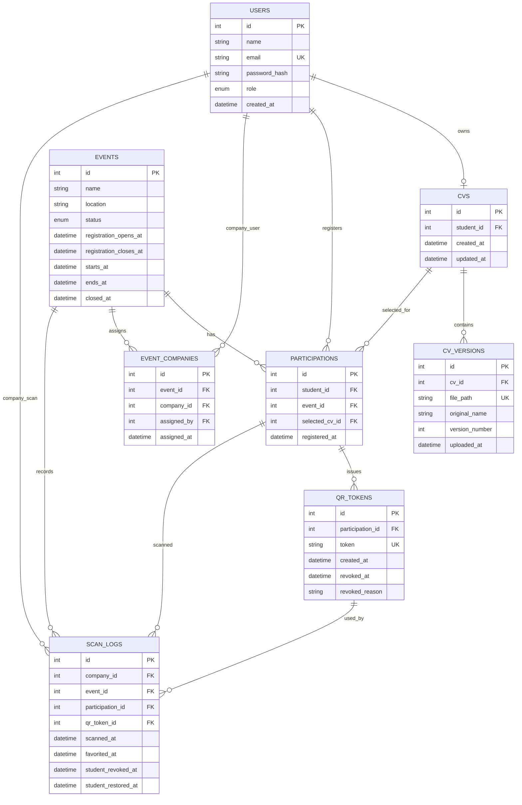
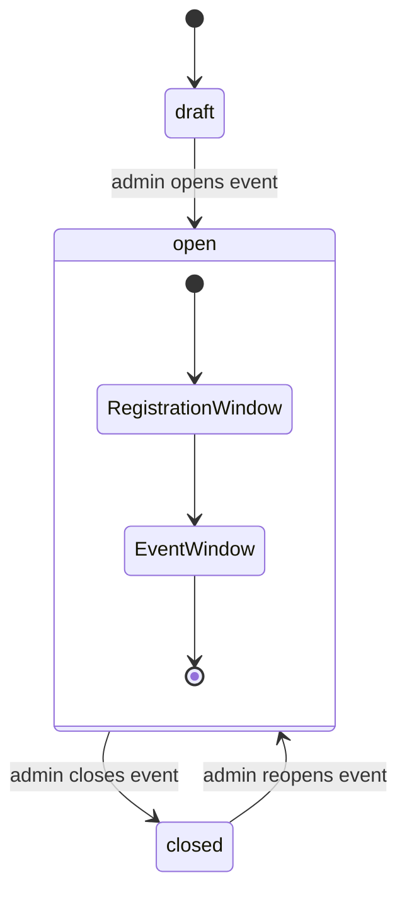
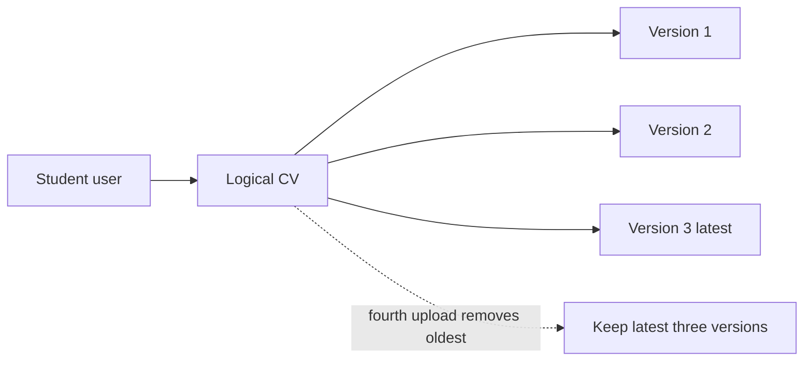
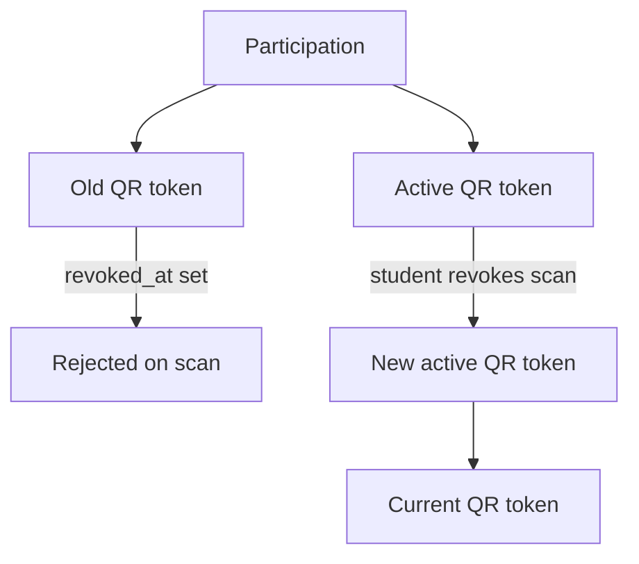

# Data Model

The database model is defined in:

```text
backend/config/schema.sql
```

The central concept is a participation: one student registered for one event.

## Main Concepts

| Concept | Meaning |
| --- | --- |
| User | A person account with role `student`, `company`, or `admin`. |
| Student email domain | An allowed email domain that self-registers as a student. |
| Event | An admin-managed career event with registration and event date windows. |
| Company assignment | A company user assigned by an admin to a specific event. |
| CV | One logical CV record for a student. |
| CV version | A retained uploaded PDF version for a logical CV. |
| Participation | A student's registration for an event. |
| QR token | A token linked to one participation. |
| Scan log | A company user's scan record for one participation. |

## Tables

| Table | Purpose |
| --- | --- |
| `users` | Stores students, company representatives, and admins. |
| `student_email_domains` | Stores exact domains that register as student accounts. |
| `events` | Stores event name, location, lifecycle status, registration window, event window, and closure timestamp. |
| `event_companies` | Links company users to events. |
| `cvs` | Stores one logical CV record per student. |
| `cv_versions` | Stores retained uploaded PDF metadata and file paths. |
| `participations` | Links a student to an event and optional selected CV. |
| `qr_tokens` | Stores active and revoked QR tokens for participations. |
| `scan_logs` | Stores company scans, favorites, revocation, and restoration state. |

## Relationships



## Event Fields

Events include:

- `name`
- `location`
- `status`: `draft`, `open`, or `closed`
- `registration_opens_at`
- `registration_closes_at`
- `starts_at`
- `ends_at`
- `closed_at`
- `created_by`

Registration and scan access are different windows:

- registration uses the registration window,
- company scanning uses the event start/end window.



## Participation Rules

Participations connect students to events.

Important rules:

- a student can register for an open/registerable event,
- a student can only have one participation across currently open events,
- a participation can exist before the student has a CV,
- QR generation requires a selected CV with at least one retained version,
- a student can participate again in later events after earlier events close.

## CV Version Rules

The MVP uses one logical CV per student:



Application code keeps the latest three versions. When a fourth version is uploaded, the oldest retained version is removed.

Uploading a new version does not rotate the participation QR token. The token resolves to the latest retained version.

## QR Token Rules

QR tokens belong to participations:



Only one token should be active for a participation at a time. Old tokens can remain for traceability but are revoked.

Student revocation rotates the active QR token so the revoked company cannot keep using the old QR interaction.

## Scan Log Rules

`scan_logs` represents company access and audit history:

- one scan row per company and participation,
- `favorited_at` records company favorites,
- `student_revoked_at` hides access from that company,
- `student_restored_at` records access restored after a fresh scan,
- rows stay available for admin audit after event closure.

Company-facing access is not determined by `scan_logs` alone. The app also checks:

- company role,
- event assignment,
- event active window,
- event not closed,
- participation still has a CV,
- scan not revoked.

## Important Constraints

| Constraint | Reason |
| --- | --- |
| `users.email` is unique | Prevents duplicate accounts. |
| `cvs.student_id` is unique | Enforces one logical CV per student. |
| `participations.student_id, event_id` is unique | Prevents duplicate registration for the same event. |
| `event_companies.event_id, company_id` is unique | Prevents duplicate company assignment. |
| `scan_logs.company_id, participation_id` is unique | Keeps one scan/access row per company and participation. |
| `qr_tokens.token` is unique | Keeps QR token resolution unambiguous. |

## Production Note

`schema.sql` is suitable for local development and demonstrations. A production version should replace it with migration tooling so data can evolve without destructive resets.
