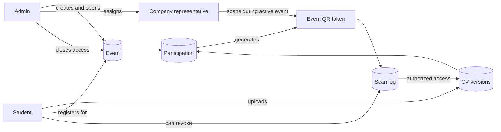

# Project Overview

CVQR is a mobile-first web application for a school career meetup. It replaces printed CV handouts with a controlled digital workflow:

1. Students upload a PDF CV.
2. Students register for an open career event.
3. The system generates an event-specific QR code for that student participation.
4. Company representatives scan the QR code during the active event.
5. Companies can view or download only the CVs they scanned while they were assigned to that event.
6. Admins manage events, assignments, users, CVs, registrations, and scan audit data.

The project is a working prototype, not a production-hardened platform. It focuses on demonstrating the full flow clearly and safely enough for a local school demo.

## Product Flow

## Problem

At career meetup events, students often print too many or too few CVs. They must carry paper copies, and companies must collect, sort, and preserve paper documents during a busy event.

CVQR reduces that friction by making the CV exchange digital while still preserving the important real-world interaction: a company only receives app access after scanning a student's QR code during an event.

## Target Users

| Role | Main needs |
| --- | --- |
| Student | Upload and update a CV, register for an event, show a QR code, and revoke company access when needed. |
| Company representative | Scan student QR codes, preview or open scanned CVs, favorite useful scans, and revisit current accessible history. |
| Admin | Prepare events, assign companies, monitor users and registrations, inspect scans, delete CVs, and close event access. |

## Current Product Scope

CVQR currently supports:

- student, company, and admin accounts,
- role-based login and page protection,
- student self-registration through allowed email domains,
- PDF CV upload and retained version history,
- event registration for students,
- event-specific QR tokens,
- company assignment to events,
- camera, image, and token/URL QR scan options,
- company scan history and favorites,
- student-controlled revocation of company access,
- admin event lifecycle management,
- admin audit visibility after event closure,
- demo data for realistic presentation scenarios.

## Core Product Rules

| Area | Rule |
| --- | --- |
| Roles | Self-registration assigns `student` when the email domain is allowed; otherwise the account becomes `company`. Admins are seeded or inserted directly. |
| Events | Admin-managed events can be `draft`, `open`, or `closed`. |
| Registration | Students can register only for events open for registration. |
| Participation | A participation is one student registered for one event. |
| Student event limit | A student can have only one participation across events that are currently open. |
| QR ownership | QR tokens belong to participations, not directly to students or CV files. |
| CV versions | Each student has one logical CV with up to three retained uploaded versions. |
| CV updates | Uploading a new CV version does not rotate the QR token; the QR resolves to the latest retained version. |
| Company scanning | A company must be authenticated, assigned to the event, and scanning while the event is active. |
| Revocation | Students can revoke a company scan. Revocation rotates the active QR token. |
| Restoration | A company can regain access only by scanning the student's current QR token again. |
| Event closure | Closing an event removes company-facing access but keeps admin audit records. |

## MVP Boundaries

The current prototype intentionally does not include:

- email verification,
- separate company organization accounts,
- production-grade password policy,
- production database migrations,
- browser automation test coverage,
- object storage for uploaded CVs,
- full deployment automation.

Those are sensible next steps if the prototype becomes a real production service.
