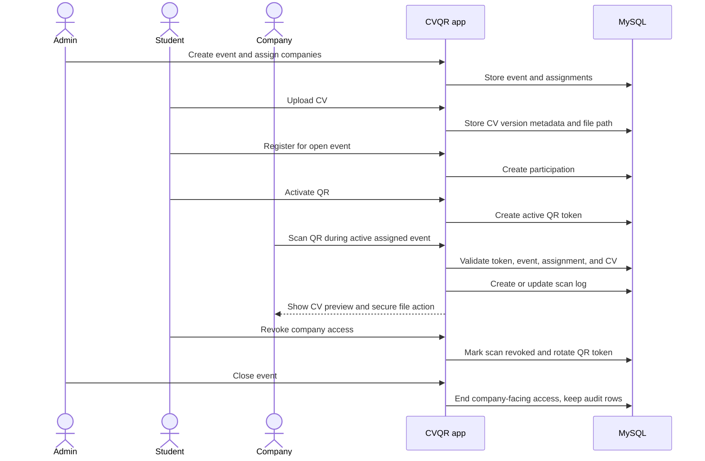

# User Guide

This guide explains how the application is used by each role.

## Logging In

Open:

```text
http://localhost:3000/
```

Choose login or registration.

After login, the app redirects by role:

| Role | Destination |
| --- | --- |
| Student | `/student/` |
| Company | `/company/` |
| Admin | `/admin/` |

## End-To-End User Journey



## Student Workflow

Students use CVQR to upload a CV, register for an event, show a QR code, and control company access.

### Upload A CV

1. Log in as a student.
2. Open `/student/` or `/student/cv/`.
3. Choose a PDF CV file.
4. Upload it.

Rules:

- only PDF uploads are accepted,
- upload size is limited by backend middleware,
- the app keeps up to three latest CV versions,
- new versions become the latest CV available through the QR flow.

### Register For An Event

1. Open the student dashboard.
2. Review open events.
3. Click `Register` for the event.

The app only shows events that are currently open for student registration. A student can have only one participation across currently open events.

### Activate Or Show A QR Code

After the student has an event participation and a CV:

1. Open `/student/`.
2. Use the QR panel.
3. Activate or check the QR.
4. Show the QR image, URL, or token to a company representative.

The QR is event-specific. It represents the student's participation, not just the student account.

### Revoke Company Access

When a company scans the student's QR code, it appears in the student company access list.

To revoke:

1. Open `/student/`.
2. Find the company in the access list.
3. Click `Revoke access`.
4. Confirm the action.

Revocation hides that scan from the company and blocks CV file access through the app. It also rotates the student's active QR token. The company can regain access only by scanning the new current QR token.

## Company Workflow

Company representatives use CVQR to scan student QR codes during events they are assigned to.

### Check Assignment State

Open `/company/`.

The scanner is available only when:

- the company user is assigned to an event,
- the event is open,
- the current time is inside the event start/end window,
- the event has not been closed.

If the company is assigned to a future or draft event, the page shows an assigned-but-not-scannable state. If the company has no assignments, the page shows a waiting state.

### Scan A QR Code

The company scanner page supports three options:

- camera scanning,
- QR image upload,
- token or URL paste.

For local demos, the token input is the most reliable. Example:

```text
http://localhost:3000/qr/demo-emma-current-token
```

After a successful scan, the app opens the scanned CV view.

### View And Favorite Scans

On the scanned CV page, a company can:

- see student and event metadata,
- preview the PDF,
- open the authenticated PDF file,
- favorite or unfavorite the scan.

Open `/company/history/` to revisit current accessible scans and filter favorites.

Company history does not show:

- revoked scans,
- closed-event scans,
- scans from events where assignment or active access no longer applies.

## Admin Workflow

Admins manage the operational setup and audit views.

### Dashboard

Open `/admin/`.

The dashboard shows:

- event count,
- user count,
- CV count,
- registration count,
- live and upcoming events.

### Manage Events

Open `/admin/events/`.

Admins can:

- create events,
- edit event name, location, and date windows,
- open events,
- close events,
- inspect event detail.

Events have separate registration and event windows. Registration controls student sign-up; the event window controls company scanning.

### Assign Companies

Open an event detail page from `/admin/events/`.

Admins can assign or unassign company users. A company account alone is not enough to scan; it must be assigned to the event.

### Inspect Users, CVs, And Registrations

Admin pages:

| Page | Purpose |
| --- | --- |
| `/admin/users/` | Search and filter student, company, and admin accounts. |
| `/admin/cvs/` | Inspect CV records, versions, and delete actions. |
| `/admin/registrations/` | Review student participations and company assignments. |
| Event detail pages | Review event summary, company assignments, participations, and scan audit rows. |

### Close An Event

Closing an event removes company-facing access to event scans and CVs. Admin audit records remain available.

This distinction matters: CVQR can remove app access, but it cannot revoke files a company already downloaded outside the app.

## Demo Tips

Use these accounts for a concise presentation:

| Role | Email | What to show |
| --- | --- | --- |
| Admin | `admin.demo@cvqr.local` | Event setup, assignments, audit views, closure. |
| Student | `student1@school.com` | QR code, CV versions, revocation. |
| Student | `student5@school.com` | Register after already having a CV. |
| Company | `flexso.recruiting@example.com` | Active scan, CV preview, history, favorites. |
| Company | `easi.recruiting@example.com` | Future assignment state. |
| Company | `gumption.recruiting@example.com` | Unassigned state. |

All seeded demo accounts use `DemoPassword123!`.
